## 研究此系统的开端
很多次，我辛辛苦苦写的评论，明明写的很精彩，却收不到点赞，我再回到我发评论的评论区时，妈的！评论没了！我可没有在骂人引战说脏话什么的！  
而且这种情况不止一次，很多次了！写那么多次的评论都白写了！而且被删除了也没有通知！  
删就删，起码也要告诉我一声吧！触碰了违禁词被系统删除也罢，违规也罢，但评论被删除后凭什么没有任何通知！？其他社交平台因评论违规等原因被删除都会发送通知并注明原因。  
后面通过多次实验证明，B站是压根就是没有删除评论给你通知的这个功能，所以评论被删除是无声无息的。你哪条评论被删除了，你不回头来看，你永远也不知道！  
  
正当我深入研究这个系统，我发现了更可恶的事情。我试着发了一条评论“陈睿操你妈的，我干死你妈”，我去，这还发送成功？？而且刷新多次评论都还在，不对呀！我再去用另一个不登陆账号的浏览器打开这个视频下的评论区，嗯，果然找不到那条评论。登录账号的浏览器退出账号，没有找到那条评论，之前没有登录账号的浏览器在登陆我的账号，那条评论就又出现在了评论区里。好家伙，学会欺骗用户了！
## 阿瓦隆系统的官方介绍
哔哩哔哩官方在2021年6月26日发布的[BILIBILI 12 周年演讲](https://www.bilibili.com/video/BV1CV411s7jd)中的p2章节 16:00-17:24里讲到

> 而且得话，就是这些举报并不是他举报一条就只对一条生效，其实用户的每一个点赞和举报，都是为我们的自动化的系统来增加数据。我们专门上线了一个，基于人工智能的，弹幕和评论的自净系统，我们起名叫“阿瓦隆”。 <br/><br/>
对，这个名字我相信喜欢《Fate》的用户，应该都很熟，然后这个系统他会根据，用户对于弹幕的点赞和举报的数据，自动去识别不良的弹幕和违规的弹幕。
目前，这个系统每天可以自动化处理超过70万条社区的负向的弹幕内容。<br/><br/>
其实我们从统计数据可以看出，就是虽然有不少用户都在反馈，“这个弹幕不好”“这个评论不好”，但是真正不良的弹幕和违规的弹幕，在我们整个弹幕池里面的占比不到1%，但是事实上就是这不到1%的内容，它对于大家的体验的影响是特别特别坏的，大家对于弹幕的很多坏的印象，就来自于这百分之零点几的内容，所以的话就是我们通过用户的举报，通过AI系统的自动化的识别，我们找到了这百分之零点几的坏内容之后，把它清除掉，那么弹幕的体验就可以有着非常非常好的一个改善
### 评价
- 可笑的是，此系统出来后，评论区与弹幕区的语言环境并没有得到太大改善，反而比此系统上线前的时间更加糟糕！阴阳怪气、人身攻击、辱骂、水军等不友善评论并没有因此而减少，反而自己好好说话发条评论却要再三检查，是否正确的发出去了。坏的内容没有识别掉并清除，反而正常的言论有极高的几率会被误识别，然后清除掉。尤其是带点情绪或见解的评论。阿瓦隆的出现，使得评论系统变得极其荒诞。做出来这么强大的系统，留下的却是这些评论，你会不会觉得很失败？！  
- 即使是在审核最严格的新华社的一个视频下[日本东电将试验用福岛核污水养鱼](https://www.bilibili.com/video/BV1W3411s7Xs)，这是高度戒严控评的评论区，竟然可以出现比台独更加恶毒的评论（因为评论区所有评论需人工审核，也象征了平台的立场就与评论一致）：  
┬？？？这是打算给谁吃  
├回复：台湾  
└回复：台湾  
竟然还能出现如此恶毒的评论，他们的矛头对准的不光是台独分子，而是所有台湾人！见你们天天喊着台湾是中国不可分割的一部分的口号，但自己却在制造争端，恨不得与他们分裂了……那么谁才是台独的促进者呢？

- 或许这不应该完全责怪哔哩哔哩这个平台，在有关部门的内容审查监管的不断施压下，也不得不这么做
## 评论、评论区与机制

### 你的评论可能会遭到怎样坏的处置
1. 警告你“评论内容包含敏感信息”，并阻止你发送，你可以妥善修改后再次发送。用得很少，碰到类似“无删减版”、“催情药”等极端的关键词才会触发，多数用的是下面的处置方法。（以上两个敏感词现在已不会触发，现在（2022年），发送“无删减版”该敏感词竟然“发送成功”，两个敏感词均可正常发送，但使用下面的方式处置，笔者记得遇到这种情况最后一次在2021年，之后再也没有遇到了。当然，终极咒语“198964”会触发的哦！好在测试时没被封号😂）。  
（_ps：现在（2022-12）番剧的评论区，发送任何emoji都会提示评论包含敏感信息，应该是发emoji导致服务器出问题的bug，然后因为屎山代码摆烂不想修索性屏蔽掉_） 
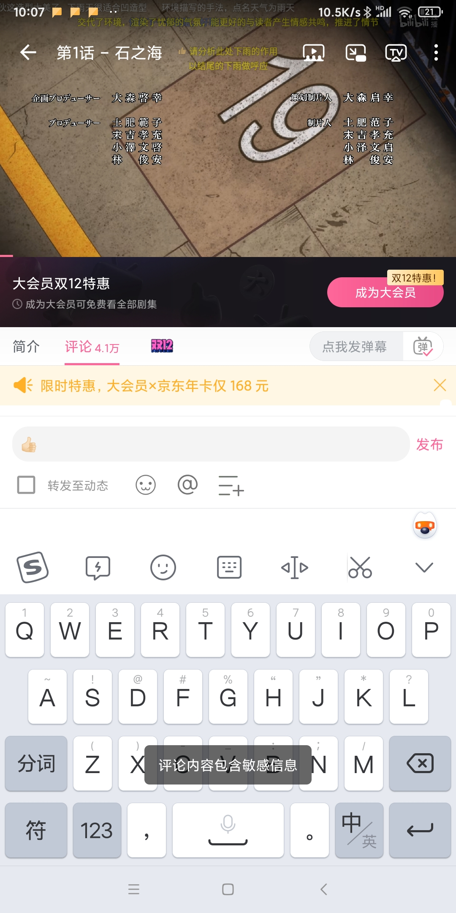

```JSON
//评论包含敏感信息的http请求应答
{
  "code": 12016,
  "message": "评论内容包含敏感信息",
  "ttl": 1,
  "data": null
}
```


2. “发送成功”并删除。你的评论发出去告诉你“发送成功”，你刷新评论区，你所发表的评论会消失在评论列表里。你发出去的评论，秒删，但是你没有刷新评论区，你对你的评论进行回复，会提示你“已经被删除了”，回复评论失败。（_ps：手动http请求，对一个不存在的评论ID进行回复，给你的回复是“没有该评论”。建议使用回复评论进行检查，比刷新评论区检查，你能够准确得知评论被删了_）。如果你的评论在回复别的评论时被秒删，点击你的评论进入详情自动定位位置，会报错“评论已不存在”（貌似这是安卓APP才有的功能）。以上，你得知自己评论被秒删后，再发完全一样的评论，会提示你“重复评论，请勿刷屏！”，但是该限制会在一段时间后解除，完全一样的评论可再次“发送成功”，不过你懂的，既然是完全一样的内容，那么你的评论将再次遭到秒删  

```JSON
//回复被系统删除的评论
{
  "code": 12022,
  "message": "已经被删除了",
  "ttl": 1,
  "data": null
}
```

```JSON
//回复不存在的评论
{
  "code": 12006,
  "message": "没有该评论",
  "ttl": 1,
  "data": null
}
```


3. “发送成功”但是自欺欺人，那就是仅自己可见！也称“ShadowBan”。这是b站最常用的控评手段！评论发布后，此评论依然会正常的出现在你面前评论列表中，刷新页面也可以正常显示，且可以对评论进行回复。但是你使用小号或直接不登录账号查看该评论区，你会死活也找不着你的评论。同时，两者的评论区评论数量也不一致，你发表评论账号下的评论区比别人评论区下的评论数量多一个。即使你是评论区的up主，也无法避免评论被shadowban，这就出现了把评论顶置了也没有观众互动的奇葩场景。  
我**猜测**这是“待审核”状态，有一次测试的时候已发现是被自己可见了，但是忘记删除评论了，结果过了一天后，用来测试的up主账号居然收到了小号对我视频发表评论的通知，而且评论正常显示。收到通知的时间比发布评论的时间晚了十几个小时，已经被shadowban的评论过了一段时间就放出来了，这期间是有人在看这条评论然后觉得没问题就释放了吗？他认为自己（阿瓦隆系统）是机器，觉得似坏非坏不能自己说了算？然后，把我的评论移交给人工进行审核，审核通过后，评论便会变为正常状态，其他人也可以正常的看到该条评论。如果审核不通过，该条评论会被删除掉，那怕是评论者自己也获取不到该条评论。当然，很多时候评论的归宿是永远为仅自己可见状态。所以不要指望这个，发评检查到异常就删了改改再发。  ~~(待审核机制我觉得是我瞎猜的，因为被仅自己可见的评论现在已经很难看到它自己恢复正常了）~~  
（ps：被shadowban的评论在最新评论里可以找得到，但是**有概率**会在最热评论里会找不到，且最热评论数量比最新评论数量少一条，有时候是少不止一条）  
（ps：以上，已知评论被隐藏，获取该评论ID，使用别的账号再经过手动http请求对该评论进行回复，竟然可以回复成功！！评论根发布者可以正常看到该回复评论，但是该回复评论的发布者看却不到自己发的评论以及根评论。感觉真是……小母牛坐飞机，牛逼上天了！）  
（ps 2023-3:呸，还移交人工！是放在待申诉列表里，等着你去申诉呢！特么就连申诉很多时候都是机器人在干活😅）
1. 官方承认的隐藏评论机制，但很诡异，官方的介绍参见：[[评论功能操作指南-哔哩哔哩客服](https://m.bilibili.com/video/BV1tG4y147F9)]视频02:24-03:18。“**基于系统AI模型筛选，不良言论将会被隐藏，仅发送者自己可见。被隐藏的评论，将在发布14天后自动删，up主可以将被隐藏的评论公开**”。好家伙，发现评论仅自己可见机制后的近一年才发现这个机制是官方所承认的。但我作为一个up主，所有稿件里的被隐藏评论列表里竟然从未出现过一条评论！即使是使用小号故意去触碰关键词发送评论，使其仅自己可见，虽然up主在评论区下看不到该评论，但是被隐藏评论列表里也没有出现任何评论。或许是这种方案的bug使up主没能收到评论使其变成了方案3，又或者是别的原因，评论被隐藏也故意不让up主知道并决定是否展示。  

2. 被举报，但它会有通知的哦！ ！不像前面那样无声无息的给你处理掉。也会告诉你是什么原因而被删除，例如：“您好，您在<视频名称>下发布的评论『\*\*\_\*\*\_\*\*\_\*\*\_\*\*”』被举报涉嫌违规，经核实因<原因>已被移除。<参阅相关规则>，良好的社区氛围需要大家一起维护”

为同时表明评论shadowban与秒删这两种情况以及节约字符，以下把这两种情况统称为“被ban”

### 如何审查你的评论
1. 穷举，将所有敏感词列成列表依次匹配，也就是词典。最简单的的审查方式，同时效率较低。大的网站一般都不会使用。（b站不用）
2. 正则表达式。参见[[正则表达式 – 语法 | 菜鸟教程](https://www.runoob.com/regexp/regexp-syntax.html)]。全网用得最多的的方式，效率最高且智能。还可以对付用“-”将敏感词分割的行为，列如“习-近-平”，以及更方便的列出所有谐音字组合。网易我的世界用的正是此方式，如图：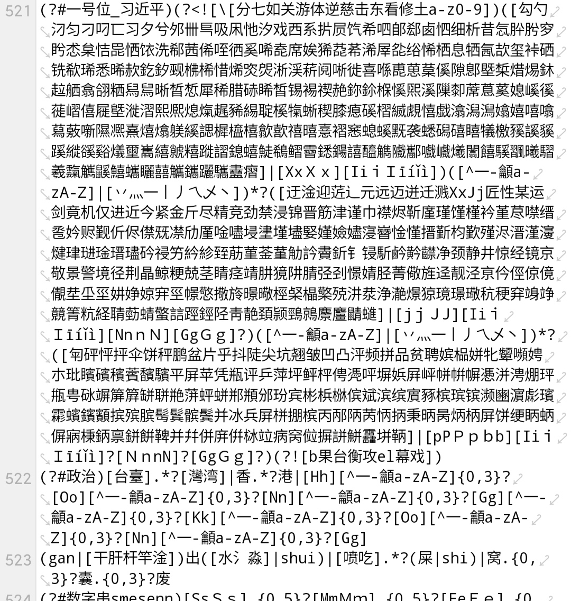
3. AI神经网络审核。这个技术我摸不透，因为我没玩过AI（不喜勿喷），给我的感觉是吃显卡、用大量数据进行训练、近乎拟人。哔哩哔哩官方的介绍中使用的就是类似的，阿瓦隆官方介绍是AI深度学习，以用户举报的数据所训练出来的系统。跟AI识别黄图是差不多的功效，你放一堆图片进去并告诉它那些是黄图，这样训练之后再喂给他一堆新的图片，他便可自己找出哪些是黄图。它没有正则表达式那么死板，有的词语单独发不出来，但你在前面加点东西就行了，真是让人摸不着头脑。~~不止b站，YouTube也在用，也用在识别画面与声音或者标题简介上，系统看不爽的就赠送一个黄标给创作者，比如[[退出Youtuber！中國廣告商太有錢了，買下油管？ - 攝徒日記Fun TV](https://youtu.be/hS12ONTJzMQ)]。~~   最后这训练的AI系统有够脑瘫的吼，笔者没变成反贼之前，是一直待在b站数码区的，因为手机系统差别对待跑分软件和游戏软件，我就用“游戏我唯唯诺诺，跑分我重拳出击！”讽刺，这居然会被shadowban！呀，这算哪门子的脏话啊？试了半天发现是“唯唯诺诺”+“重拳出击”才会触发。我再去其他软件试毒这句话，像贴吧、网易我的世界、原神等等都不会被和谐。网易版我的世界把自己图标上的“草”都给屏蔽了（被骂后改了），都没有屏蔽这句话，全网唯独你b站的评论区发不出“网络上重拳出击，现实中唯唯诺诺”这句话。你是什么牛马，用全b站用户举报评论的数据就训练出来你这智障？！又或者说：某正常的评论被恶意举报多了，那么类似的正常的评论也会被视为异常了。
4. 人工。费时费力，在特殊的评论区才会使用。

### 评论区戒严机制
有这么些评论区，你发布任何评论都会被ban，有的直接删除，有的仅自己可见。这与发布者自行设置的“评论经筛选后展示”无关！评论区戒严是被动且隐性的，即使是内容上传者也不知道自己的评论区被动了手脚！即使是up主的评论也同普通人的命运一致。不过这些评论区都有着数量不少的评论，但评论与播放量的比例要比正常视频要少非常多。正常的账号到这里发布评论肯定是祖传的“发送成功”但都会被ban。那么你看到的那些评论又如何被放出来的呢？虽然你发布的每一条评论都被ban，但都会被记录，这些评论将会被送至人工，由人工筛选出一些评论正常展示。有些评论区也可以看到你担心可能会被删的那些批评与讽刺之类的评论，那这就得看审核人员的良心咯。  

如果你觉得只有少数特别有争议或舆论爆炸的视频才会被戒严，那你太天真了，这是b站的惯用伎俩，基本上跟某件事沾点边的必被戒严。就比如疫情（放开之前）相关吧，不是那些媒体的哦，就是普通up主发布的，没有一个视频能逃得了被控的命运。你可以发送“测试”进行测试，如果被秒删或仅自己可见就是的了。

至于是怎么被戒严的？或许这些由阿瓦隆自动识别并标记，或许在审核员的控制台上，有一个勾选框，可以将其评论区设置为戒严状态。  
### 被触发戒严机制内容列举
- [敖厂长](https://m.bilibili.com/space/122879)所有视频
- 来自新华社、央视新闻、外交部等中共官媒
    - [赵立坚说关于人口贩运美国最应该指责自己](https://www.bilibili.com/video/BV1aS4y1o7Gd)
    - [日本东电将试验核废水养鱼](http://www.bilibili.com/video/BV1W3411s7Xs)
    - ……
- 内容疑似辱包但其实并没有辱包行为，但又不好意思以侮辱国家领导人为由删除别人视频，只要评论区里没人在怀疑这是在辱包就行😂
    - [包子也疯狂，就快要凉凉](http://www.bilibili.com/video/BV1UB4y1m7we)
    - [“今天来修整这个细颈瓶”（陶艺入门详细讲解 陶艺大师细颈瓶跳刀修坯过程）](http://www.bilibili.com/video/BV17R4y1p7Pe)
- 熊脸识别（[推特@GFWfrog：长相触发熊脸识别机制🐻，评论区已被动态清零！](https://t.co/4Q5qMeauQ0)）
   - [盛嘉奎盛嘉奎（用户所有视频）](https://space.bilibili.com/1095942906)
- 敏感时事类，列如（不选央视新闻等党媒，因为此类up自带评论区戒严性质）
   - 安倍晋三遇刺相关
       - [安倍晋三遭枪击多机位视角](http://www.bilibili.com/video/BV1s94y1X7jH)
   - 河南村镇银行红码事件（点名批评b站没有骨气，对正义发声的视频进行评论区戒严）
     - [连线河南村镇银行储户：飞机刚落地就被带走 然后健康码红了](http://www.bilibili.com/video/BV1XZ4y1Y7oi)
     - [河南村镇银行取款难 警方通报：团伙涉嫌利用村镇银行犯罪，已抓获一批嫌犯](http://www.bilibili.com/video/BV1W94y1y7fq)
- 涉台（不涉政多数不会被控）
   - [台湾人真的对同性恋很包容吗？台湾人聊聊同婚合法](http://www.bilibili.com/video/BV1WC4y1t7zY)
   - [为安倍“下半旗” 蔡英文难道还在把台湾当日本殖民地？](http://www.bilibili.com/video/BV1vV4y1n76k)
- 其他未知原因
    - [冬奥会元首专机大比拼，首都机场居然有直通市区的神秘通道？Nic机长…](https://www.bilibili.com/video/BV1sS4y1577H)
- 其他后台人员手动戒严
### 戒严机制被网友察觉
很离奇的现象，评论区里全是“test”，最终“哈喽哈喽看得到吗”成为热评第一的评论，网友们是在测试评论区吧，毕竟凤凰网前面飞机落地被红码那个视频的评论区的控评操作已经引发网友注意了。
<details markdown='1'><summary>查看图片</summary>

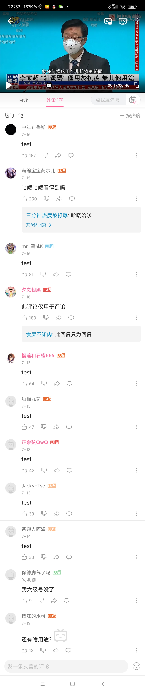

</details>

### 评论在什么情况下会被ban？
他具体审查些什么内容？这个不清楚。在我印象中正常的评论吞了非常的多，所以我无法说明那些评论会被吞，要了解具体有哪些，需要我们评论被ban的时候都记录下来，后面再进行汇总统计分析！  
目前据研究已知：
- 你们都懂的国内通用审查库，比如中共之类政治相关的敏感词
- 为什么长评容易被吞？因为越长的评论越字词越多会有概率碰到屏蔽点，而且有一些词语像“唯唯诺诺、重拳出击”，这两词要同时出现才会有效，且这两个词语不论顺序（如倒转成“重拳出击、唯唯诺诺”），还是中间隔了多长的句子都会触发。长评加剧了组合词出现的概率。总之就像你买彩票一样，买的越多越容易中奖。
- 尽量不要使用原生emoji，如“😅”，容易招到shadowban，要多用方括号表情如“[doge]”！当然是容易，不是你用了一定，有一次找半天敏感词发现是emoji的问题😅。当然番剧评论区用直接报敏感信息了。
- “susඞ”，没错，among us~！当然不是这个梗不能玩，是“ඞ”的问题。奇怪的是，也不是加了这个符号就一定会被ban，“Englishඞ”被仅自己可见，但是“中文ඞ”就可以正常显示。emm，你可能疑惑，但我也不解，或许就是阿瓦隆的bug吧。总之评论不能正常显示时，如果有特殊字符删掉再试试。
- 查重黑名单机制。非戒严的评论区，在此评论区发送与之前所发评论内容大致相同（原评论的基础上少几个字或多几个字）的评论，容易被ban！即使你在发之前把前面发的评论删除掉了，这将会对删除重发修改评论有很大的伤害。当然不是完全一致，完全一致会提示你请勿刷屏。不过此机制的触发条件是发布-删除-发布-删除-发布……发布一定次数好像3次以上才会触发，也还是考虑到了用户修改评论的需求。此机制的作用域是该评论区和你的账号，如果你的账号所发评论在这不能正常显示，copy那个评论换个号发布说不定可以正常显示。如果你在这个评论区发评被ban，不换号copy到别的评论区发布就能正常显示，所以不要以此认为你被黑号了。如果你是该评论区的up主，你将不会受到该机制的影响。
### 客服快速过审评论
当你发表一个评论，觉得完全没有问题，却被仅自己可见了，你气愤的找客服扯皮！客服觉得没问题大多数时候会给你通过，至于为什么要对你的评论下手他们自然是不会告诉你原因的。  
 
一个我自己的经历，我就逛数码圈吧，控评也无处不在。我知道b站评论区的尿性的，写这么长的评论，要发出去之前，得先复制一遍再发，然后再换到登的小号的app去查看评论是否看得见。登录了自己账号的app是不会感到异常的，接着，我切换到登了小号的app，怎么找也找不到我发的评论。好家伙，我没骂人没聊政治，这都能被ShadowBan！自我审查了下评论内容，评论是讲路由器的，死也想不到哪里有问题。防火墙？别逗了，人家“gfw”都能发出来，甚至啊B还高亮显示加了个🔍呢！！妈的直接找客服扯皮！  
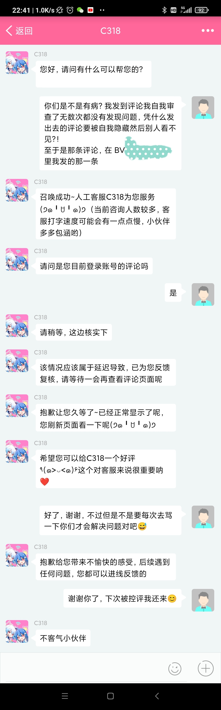  
好家伙，他没解释为什么我的评论会被隐藏，就丢一个“延迟导致”，叫我刷新界面。我在去看我的小号，刷新一下，评论就在那里正常显示了！  
所以发现评论被隐藏却不想或不好改动评论的，可以去找客服扯皮。有时候他们也这样解释
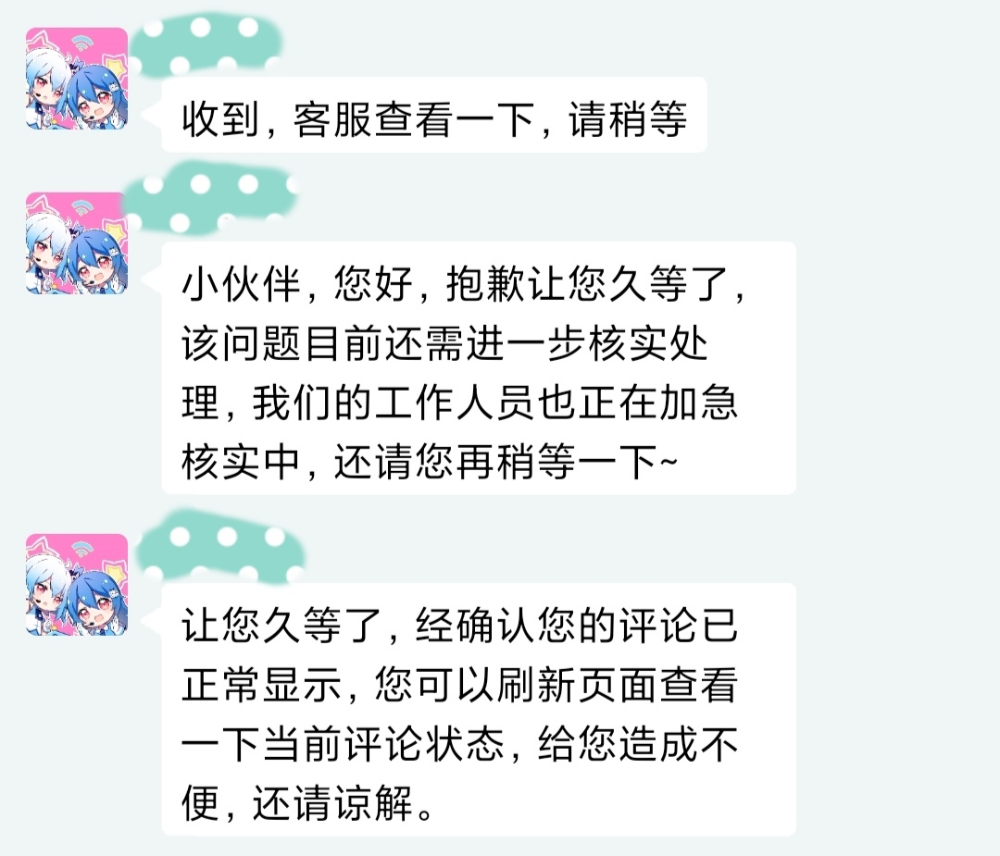
  
  
当然失败了你会被这样对待  
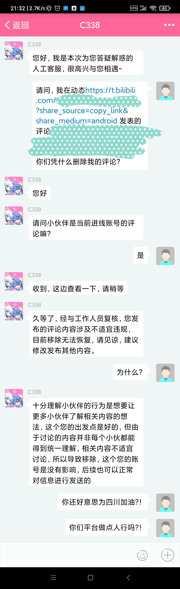

### 申诉评论（2022-12）添加
接上面，你发现评论被shadowban了，现在你再去找客服，客服将不再帮助你取消shadowban状态。而是指引你去这个地方：
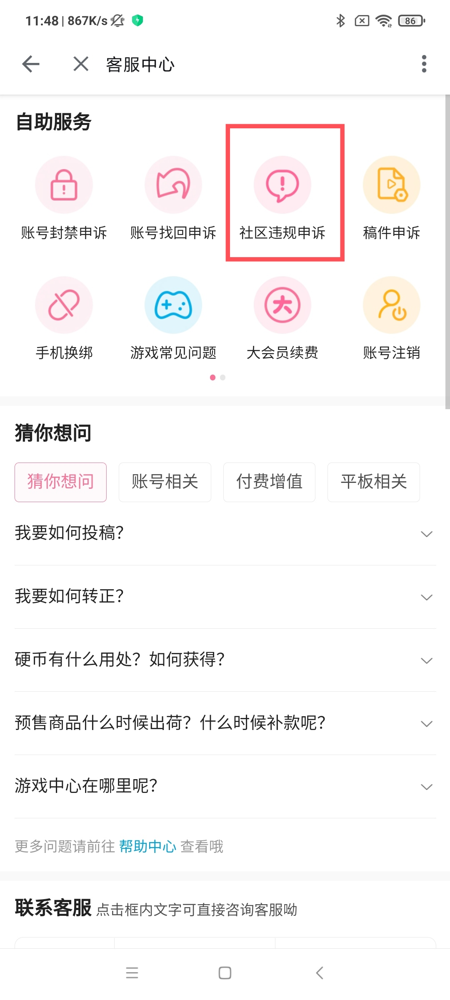
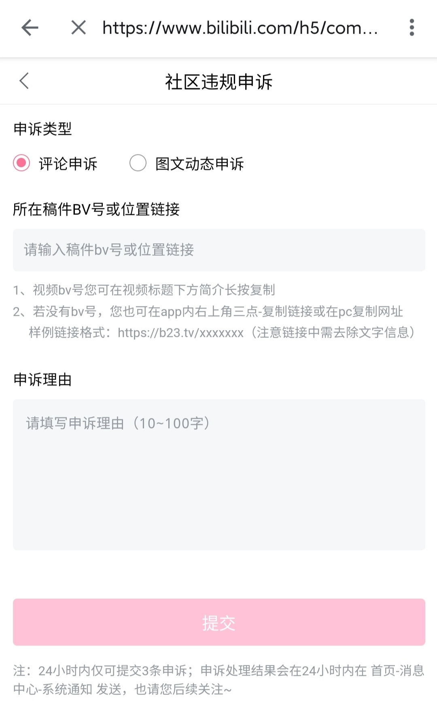
审核成功后，系统会发消息通知你。接着你的评论也正常显示。
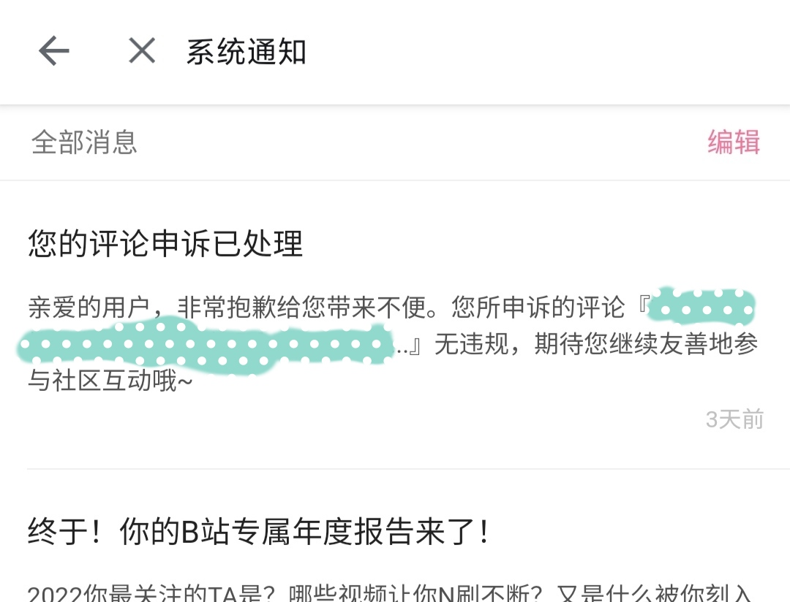
令我无语的是，申述区不会显示你所被ban的评论，丢了哪条还要你要自己去发现。以上shadowban评论的作风不会改变，依旧骗你“发送成功”，所以你得自己判断评论是否正常！（墙裂建议会油猴脚本的大佬开发一个自动检测你是否被“发送成功”所欺骗的脚本）  
  
如果发的评论正常显示，然后去申诉会发生什么🤔  
答案是：该bv号或链接下无可申诉评论  


``` json
{
  "code": 12082,
  "message": "该bv号或链接下无可申诉评论",
  "ttl": 1,
  "data": null
}
```
虽然不会显示具体ban了那个评论，但是你可以知道有没有。极限点的玩法是发完评论直接去申诉，“无可申诉”那就是评论正常，“提交成功”那就是被ban了，接着就等待系统通知就行了，每天只有三次申诉机会，不过“无可申诉”时不会消耗次数，“提交成功”才会。

### 声明：
- 以上关于此系统运作机制的结论是我通过大量的实验与研究得出。但因为机制实在是太复杂，并没有摸出全部机制。以上机制纯属个人的总结，部分可能与实际情况不符，仅供参考！如有不符，欢迎给我指正！
- 阿瓦隆是一个AI，不仅仅是敏感词识别，他还会识别出语义甚至是话中的情绪。哪怕你的语句里的所有词语都不敏感，但是意思读起来确实有点负向的，也会被识别出来。
- 随着时间的流逝，该系统也会升级，机制可能会发生变化
### 评价
其实这种控评手段非常高明：当用户发的评论因种种原因而被删除时，并给用户评论已被删除的通知，用户收到通知后，必然会想尽办法（如拆分关键词）再发一次。而不给予用户评论被删除的通知，用户也不会因为知道评论被删除而将评论重新发送。让你自以为的评论已经发出，但事实是你发了个寂寞。
### 正面评价
- 似乎系统做得还可以，不该审查掉的它没有吞噬。原神2.7版本国际服兑换码第三个“HSNUKTX~~CCP~~WV”，虽然我不知道他为什么要这样写，但我知道的是，他好故意啊🤣！你故意就故意嘛，就连你官方国际服社区都偷懒用国内同一套文本审查系统😅，发个官方发的兑换码还得分开来发！  
你看你看，我都快骂惨了的哔哩哔哩，居然不用把CCP拆开来发！
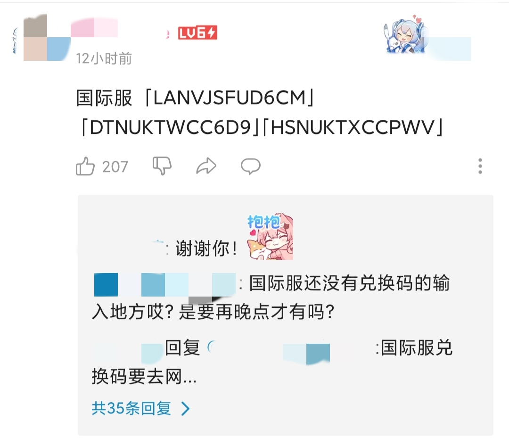
- 评论坏就删评论，大多数时候只要不是太恶劣就不会对账号造成太大威胁。就比如我在鬼畜川宝的视频，下面发了条评论“在外网可以看鬼畜\*近\*[doge]”，居然还获得了几个点赞，然后再查看那条评论的时候就报错了。最后收到了评论被举报通知，也是提醒我不要再这样了，告诫我们良好的社区氛围需要大家一起维护。但是在某绿色平台就不一样了，因为我看不惯学习通这款软件去迫害网友，然后我就调侃了一句“学“习”通😋”，你猜怎么着？评论没有第一个被删，我号先炸了！直接无法登陆，提示“发布涉嫌政治信息的违规行为”，我在这个平台从来没有发过任何政治相关的东西，唯独这一句话。最可恶的是，你找不到任何申诉渠道。最离谱的是，手机push服务还残存着我账号一丝灵魂，虽然那边已经被强制下线了，然后账号被封一天后才收到评论被删除的通知栏消息，点进去还特么提示先登陆账号。先炸号再删评论，真有你的啊！同样是拿习近平开玩笑，一个告诫我说话要遵守规则，一个先把我人杀了再删除评论！


## 阿瓦隆系统的应用域
1. 评论区
2. 弹幕
3. 直播评论区、弹幕
    - 直播评论区、弹幕不可实时去审核，识别到一律不出现在所有人面前（除了自己）
    - 博主开启实时评论在视频里的时候，可查检你的弹幕发成功没有
4. 甚至是私信
    - 部分内容识别到会进入“疑似不良消息”列表
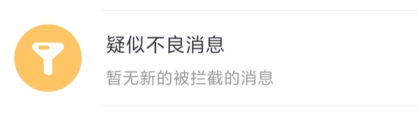
    - 如同UDP数据丢包一样，对方发出去了，但我没有收到，然后聊着聊着觉得越来越奇怪。<details markdown='1'><summary>如图</summary>
 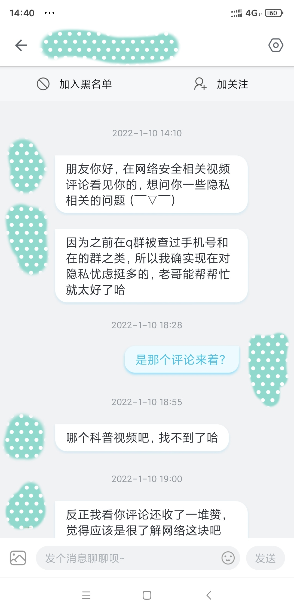
 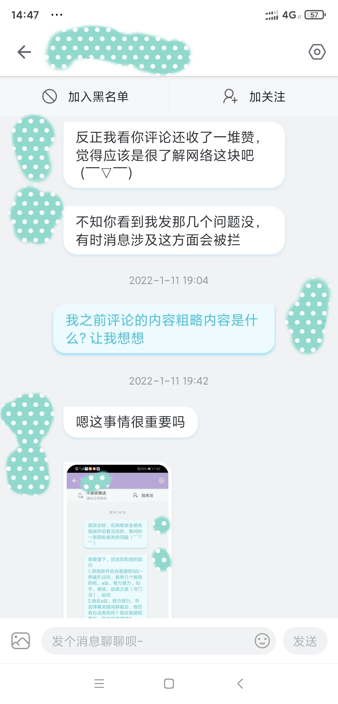
 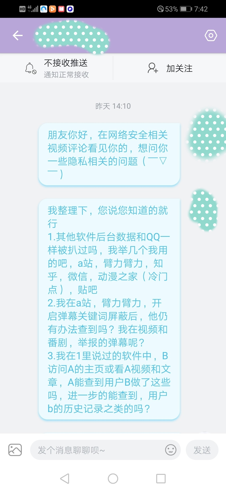
 
 </details>
 
## 关于2021年员工猝死事件的评价
如果光是审核用户的视频稿件、专栏与动态，那还不是以至于猝死人的那种程度。原本评论只需要经过简简单单的敏感词系统的警告或屏蔽，除非有人举报才会拿去人工审核。但阿瓦隆系统的出现，在用户发布评论时就筛选负面的评论出来给人工，大量的评论涌入审核员的手中，使得工作量大幅增加。关于此事的新闻，标题就指出了ai审核组，前面阿瓦隆系统的官方介绍里就明明白白地指出了，阿瓦隆系统是人工智能实现的，AI审核组很可能就是去审核用户评论与弹幕的。
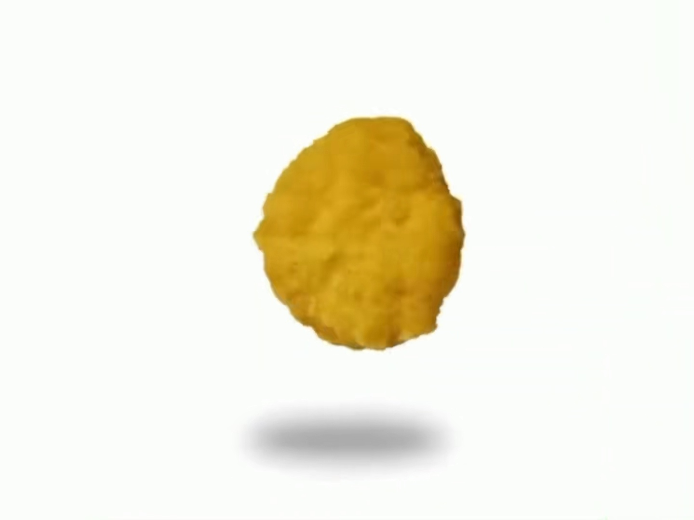
## 关于此研究文档
本文档从2022年年初开始写，中途不断研究并增加内容，耗时……

欢迎转发及引用！本文档可以转发至墙内平台，让更多人知道b站控评机制。此文档有一定的反贼色彩，为满足过审核要求，可以对本文档过激内容进行适当的删减或编辑。如果您转发至墙外平台，请务必注明出处！
## 哔哩发评反诈APP
当然我是一个安卓开发者，发送评论再用切换到双开应用小号检查，这些操作非常的繁琐。所以我做了一个软件，登录好账号后，输入评论区地址，接着输入要评论的内容，点击发送后会自动检查，并且判断评论状态，简化了用小号检查的繁琐步骤。
跳转：[哔哩发评反诈](https://github.com/freedom-introvert/biliSendCommAntifraud)。
至于浏览器端，我暂时不会前端开发，有能力的大佬可以去开发个。直接修改发送评论的逻辑，发送自动检测，还省去了输入评论区的麻烦（当然Android这边可以用Xposed）。
## 关于b23\.tv短链接使用安全与我重新创建仓库
直接在哔哩哔哩APP里获取的分享链接，是b23\.tv短链接，请注意，该短链接在生成时会附加用户信息等参数，每个人对同一个内容所分享的链接都不一样。b站有能力以短链接追踪到分享的用户，所以请不要用此链接分享到对自己有威胁的平台（比如中共网警密布的推特）！正确的做法是粘贴到浏览器后让短链接重定向成正常链接，并且删除掉“?”后面的各种参数，成为干净的链接如“https://m.bilibili.com/video/BVxxxxxxxxxx”  
因为我使用了一次b23\.tv短链接，对我个人有一定的威胁，所以我删除前面仓库重新创建（删除commit太麻烦了，没有几个star，最舒服的方式当然是删了再创建😂），。
